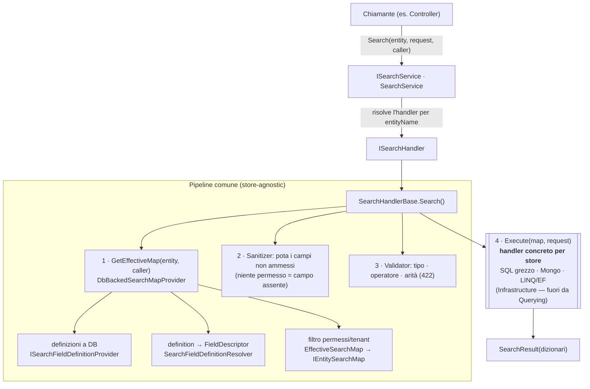

# Motore di ricerca — `Search.Application.Querying`

Guida per orientarsi nel **cuore store-agnostic** del motore di ricerca: il contratto, la pipeline e i
punti di estensione. Gli algoritmi specifici per store (LINQ/EF, Mongo, SQL grezzo) **non** sono qui: si
agganciano come implementazioni di `ISearchHandler` (vedi "Come estendere").

## Responsabilità per namespace

| Namespace | Responsabilità |
|---|---|
| `Querying` (root) | **Contratto** (`SearchRequest`/`SearchResult`) + **facade** (`ISearchService`) + **strategy** (`ISearchHandler`/`SearchHandlerBase`) |
| `Querying.Filters` | Albero di filtri store-agnostic (`FilterNode` + sottotipi) + factory `Filter` |
| `Querying.Metadata` | Mappa dei campi (`IEntitySearchMap`/`FieldDescriptor`) + regole tipo→operatore (`OperatorRules`) |
| `Querying.Authorization` | Chi cerca (`SearchCaller`/permessi), **mappa effettiva** e **potatura** (`SearchRequestSanitizer`) |
| `Querying.Validation` | Validazione "dura" (campo/operatore/arità) → 422 |
| `Querying.Dynamic` | Definizioni dei campi **a DB** → risoluzione in `FieldDescriptor` → `DbBackedSearchMapProvider` |

## Diagramma delle classi

```mermaid
classDiagram
    direction LR

    namespace Contratto_e_Facade {
        class ISearchService {
            <<interface>>
            +Search(entity, request, caller) SearchResult
        }
        class SearchService
        class ISearchHandler {
            <<interface>>
            +string EntityName
            +Search(request, caller) SearchResult
        }
        class SearchHandlerBase {
            <<abstract>>
            +Search(request, caller) SearchResult
            #Execute(map, request) SearchResult
        }
        class SearchRequest {
            +FilterNode Filter
            +Projection
            +Sort
            +Page
        }
        class SearchResult~T~
    }

    namespace Filters {
        class FilterNode {
            <<abstract>>
        }
        class LogicalFilterNode {
            +LogicalOperator Operator
            +Children
        }
        class ComparisonFilterNode {
            +string Field
            +FilterOperator Operator
            +Values
        }
        class Filter {
            <<static factory>>
        }
    }

    namespace Metadata {
        class IEntitySearchMap {
            <<interface>>
            +string EntityName
            +Fields
            +TryGetField(name) bool
        }
        class MaterializedSearchMap
        class FieldDescriptor {
            +string Name
            +FieldKind Kind
            +bool IsArray
            +Selector
            +StoragePath
            +RequiredPermissionId
        }
        class OperatorRules {
            <<static>>
        }
    }

    namespace Authorization {
        class SearchCaller {
            +Guid SpaceId
            +Permissions
        }
        class EffectiveSearchMap {
            <<static factory>>
            +For(entity, fields, caller) IEntitySearchMap
        }
        class SearchRequestSanitizer {
            +Sanitize(request) SearchRequest
        }
    }

    namespace Validation {
        class SearchRequestValidator {
            +Validate(request)
        }
    }

    namespace Dynamic {
        class SearchFieldDefinition {
            <<record>>
            +EntityName, Name, Kind, IsArray, Path, SpaceId
        }
        class ISearchFieldDefinitionProvider {
            <<interface>>
            +GetDefinitions(entity, spaceId)
        }
        class InMemorySearchFieldDefinitionProvider
        class SimulatedFieldDefinitionDatabase {
            <<static seed>>
            +Create() InMemorySearchFieldDefinitionProvider
        }
        class SearchEntityRegistry
        class SearchEntity {
            +Name, StoreKind, ClrType
        }
        class SearchFieldDefinitionResolver {
            +Resolve(definition) FieldDescriptor
        }
        class DbBackedSearchMapProvider {
            +GetEffectiveMap(entity, caller) IEntitySearchMap
        }
    }

    ISearchService <|.. SearchService
    SearchService o-- "N" ISearchHandler : dispatch per entityName
    ISearchHandler <|.. SearchHandlerBase
    SearchHandlerBase ..> DbBackedSearchMapProvider : 1. GetEffectiveMap
    SearchHandlerBase ..> SearchRequestSanitizer : 2. pota
    SearchHandlerBase ..> SearchRequestValidator : 3. valida
    SearchHandlerBase ..> IEntitySearchMap : 4. Execute(map, request)

    SearchRequest o-- FilterNode
    FilterNode <|-- LogicalFilterNode
    FilterNode <|-- ComparisonFilterNode
    Filter ..> FilterNode : crea

    DbBackedSearchMapProvider o-- ISearchFieldDefinitionProvider
    DbBackedSearchMapProvider o-- SearchFieldDefinitionResolver
    DbBackedSearchMapProvider ..> EffectiveSearchMap : usa
    EffectiveSearchMap ..> MaterializedSearchMap : crea
    MaterializedSearchMap ..|> IEntitySearchMap
    IEntitySearchMap o-- "N" FieldDescriptor
    FieldDescriptor o-- OperatorRules : operatori ammessi

    SearchFieldDefinitionResolver o-- SearchEntityRegistry
    SearchFieldDefinitionResolver ..> SearchFieldDefinition : legge
    SearchFieldDefinitionResolver ..> FieldDescriptor : produce
    SearchEntityRegistry o-- SearchEntity
    ISearchFieldDefinitionProvider <|.. InMemorySearchFieldDefinitionProvider
    ISearchFieldDefinitionProvider ..> SearchFieldDefinition : fornisce
    SimulatedFieldDefinitionDatabase ..> InMemorySearchFieldDefinitionProvider : seed

    SearchRequestSanitizer o-- IEntitySearchMap
    SearchRequestValidator o-- IEntitySearchMap
```

## Flusso di una ricerca (runtime)

Il punto chiave: i passi 1-3 sono **identici per ogni store** (vivono in `SearchHandlerBase`); solo il passo 4
(`Execute`) è specifico. È lì che si innesta un nuovo algoritmo di ricerca.

## Come estendere

1. **Nuovo store / entità cercabile** → crea un `ISearchHandler` (di norma derivando `SearchHandlerBase` e
   implementando solo `Execute`) nel progetto d'infrastruttura giusto, e **registralo in DI** come
   `ISearchHandler`. Facade, controller e pipeline non cambiano (Open/Closed).
   *Esempio esistente: `SqlSearchHandler` (Infrastructure.Sql) per lo store SQL grezzo.*
2. **Nuovo campo ricercabile** → aggiungi una `SearchFieldDefinition` (è **dato**, non codice) nella sorgente
   usata dal `DbBackedSearchMapProvider`. Nessuna classe del motore cambia.
3. **Definizioni da un DB reale** → scrivi una nuova `ISearchFieldDefinitionProvider` (es. `EfSearchFieldDefinitionProvider`)
   e **sostituisci** l'unica registrazione DI. Il resto è invariato.
4. **Nuovo operatore o tipo di campo** → estendi `FilterOperator` + `OperatorRules` (regole tipo→operatore); poi
   insegna l'operatore ai translator dei singoli store.
5. **Regola di autorizzazione su un campo** → imposta `RequiredPermissionId` sulla definizione del campo e i
   permessi nel `SearchCaller`: la potatura via mappa effettiva è automatica, nessun controllo sparso.

## Invarianti da conoscere

- **Un solo contratto** (`SearchRequest`/`FilterNode`/`SearchResult`) per tutte le entità e tutti gli store.
- **La mappa effettiva è la whitelist di sicurezza**: un campo senza permesso non è "vietato", è *assente* →
  sanitizer e validazione lo trattano come sconosciuto, senza controlli dedicati.
- **`Sanitize` pota, `Validate` rifiuta**: la potatura adatta la richiesta all'utente (toglie ciò che non può
  vedere); la validazione boccia (422) ciò che resta ma è incoerente (operatore/arità).
